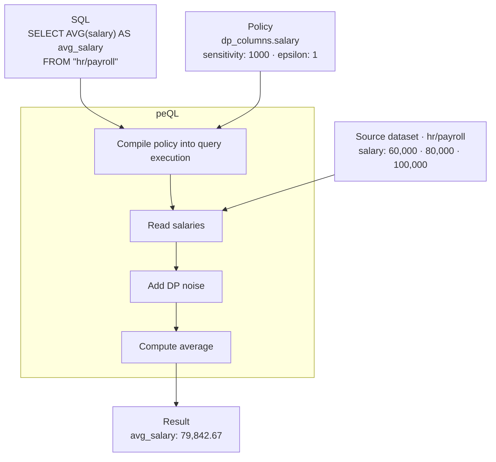

# peQL

peQL is a policy-enforcing query engine built on Apache DataFusion.
Let people query your data while keeping control over what they can see.

## The query path

A query asks for the average salary. The policy adds noise before it is calculated.



Illustrative result for a non-owner query; noise varies each run.
See [noise policy and privacy limits](docs/CONTRACT-FORMAT.md#row-filtering-and-differential-privacy).

## Quickstart

[Run the working example](docs/getting-started.md), or add peQL to your application.

Rust 1.88 or newer is required.

```toml
[dependencies]
peql = { git = "https://github.com/griot-cloud/peQL" }
```

For the standalone path, create an `Engine` from JSON contracts whose bindings
point to local Parquet files:

```rust
use peql::contract_source::Caller;
use peql::engine::Engine;

let engine = Engine::from_json_contracts_dir("./contracts")?;
let rows = engine
    .query(
        r#"SELECT AVG(salary) AS avg_salary FROM "hr/payroll""#,
        Caller::new("user:bob", "analytics", "globex"),
    )
    .await?;
```

Python bindings expose the same query path. Build a wheel from
`bindings/python` or use one produced by this repository's wheel workflow:

```python
import peql

engine = peql.Engine.from_json_contracts_dir("./contracts")
table = engine.query(
    'SELECT AVG(salary) AS avg_salary FROM "hr/payroll"',
    peql.Caller("user:bob", "analytics", "globex"),
)
```

Use Rust `Engine` or Python `peql.Engine` for queries governed by contracts.
For lower-level Rust integration through `K04DEngine`, see the
[API reference](docs/reference.md) for differences in enforcement.

## Documentation

- [Quickstart](docs/getting-started.md) — run your first query.
- [Use the APIs](docs/USAGE.md) — integrate with Rust or Python.
- [How it works](docs/concepts.md) — understand policy enforcement.
- [Contribute](CONTRIBUTING.md) — build the engine, run tests, and make a change.

## Status

peQL is currently version **0.3.0**. The new `peql` Rust and Python names are a
breaking change for downstream users of the predecessor API.

## License

License to be determined.
