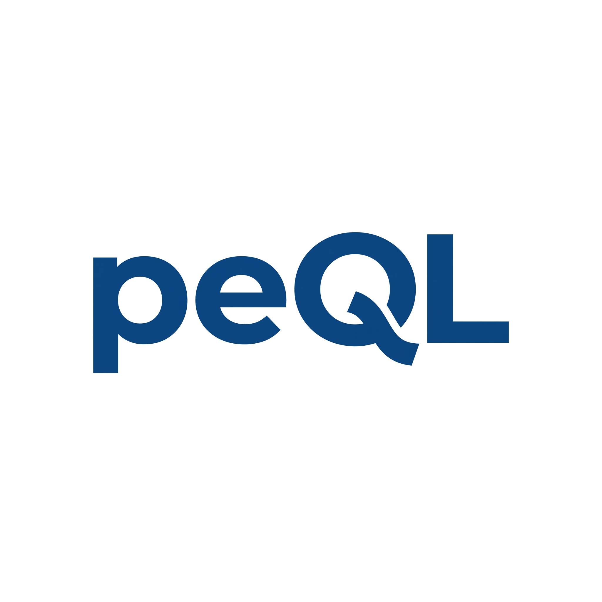

Policy Enforcing Query Engine (peQL) is a SQL query engine that lets you define different data rules and data access policies for users, agents and services, and enforces those rules whenever they query your data.

## Use cases

**Share data with customers and partners.** Let each customer query their own records from a shared dataset. Mask personal details for partners while allowing authorised staff to see them.

**Set limits on what agents can query.** Give an agent access to the rows and columns its task requires. peQL applies those limits to the SQL it submits.

**Keep failed quality checks out of reports.** Exclude rows that fail required checks, or refuse queries when a dataset fails a quality or freshness requirement.

**Share statistics with privacy rules.** Suppress results for small groups, add noise to aggregates and limit repeated queries with a privacy budget.

## Documentation

| | |
| --- | --- |
| **[Getting started](docs/getting-started.md)** Learn the concepts, then run your first queries. | **[Using peQL](docs/USAGE.md)** Work with the command line, or use peQL in Python and Rust. |
| **[How it works](docs/execution.md)** Understand validation, caller rules and query execution. | **[Reference](docs/reference.md)** Look up commands, result fields and common errors. |

Read the [documentation website](https://griot-cloud.github.io/peQL/), or browse the pages above on GitHub.

[Getting started →](docs/getting-started.md)

---

[Contributing](CONTRIBUTING.md) · [Changelog](CHANGELOG.md) · [Apache-2.0 license](LICENSE)
